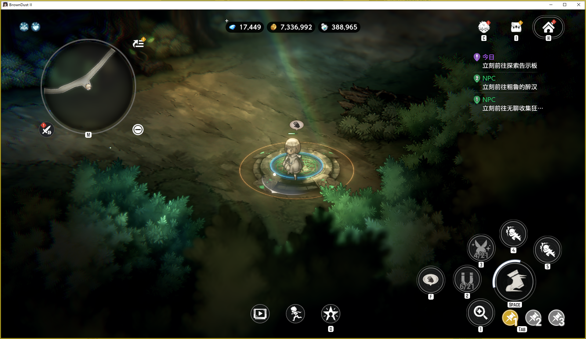
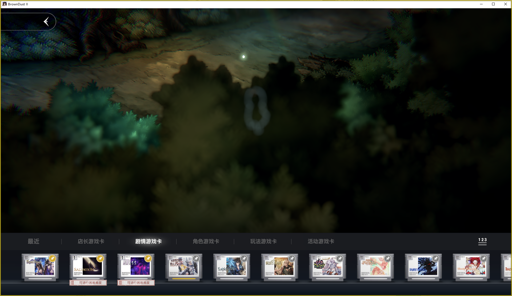
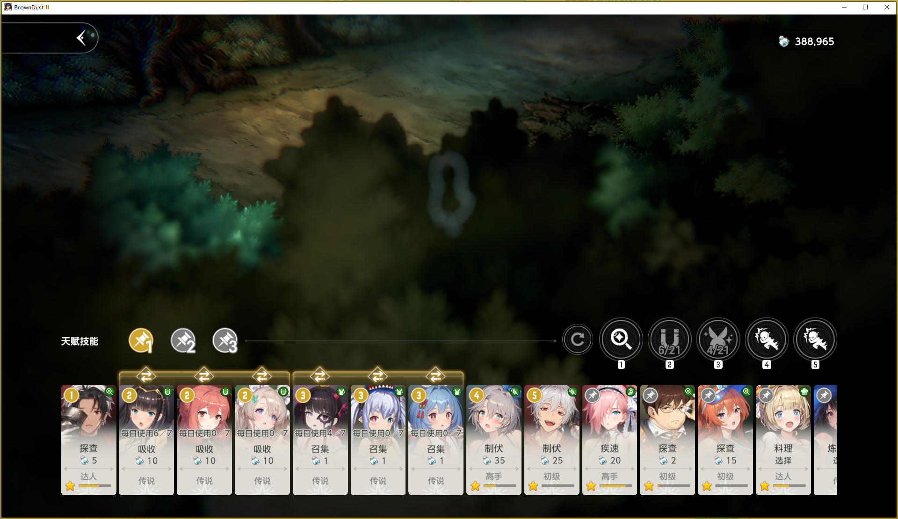

<div align="center">
  

  <h1>ok-bd2</h1>

  <p>一款基于图像识别的 <strong>BrownDust II</strong> Windows PC 自动化辅助工具。</p>
  <p>基于 <a href="https://github.com/ok-oldking/ok-script">ok-script</a> 框架开发。</p>

  <p>
    
    
    <a href="https://github.com/GodRaymond233/ok-bd2/releases"></a>
    <a href="https://github.com/GodRaymond233/ok-bd2/releases"></a>
    <a href="./LICENSE"></a>
  </p>
</div>

## 免责声明

> [!CAUTION]
> 本软件为开源、免费的外部辅助工具，仅用于个人学习、研究 Python、计算机视觉、OCR 与 UI 自动化。
>
> - **工作原理**：程序通过识别用户界面、截图和模拟输入与游戏交互，不读取或修改游戏内存，不修改游戏文件。
> - **使用风险**：自动化工具可能违反游戏、平台或发行方服务条款。使用本项目产生的账号、数据、收益或其他后果，由使用者自行承担。
> - **项目关系**：本项目与 BrownDust II 的开发商、发行商及相关平台没有从属、授权、认可或合作关系。
> - **商业行为**：本项目不提供也不认可代练、售卖脚本、商业托管或其他营利性用途。

> [!WARNING]
> 在使用本工具前，请确认你理解并愿意承担第三方自动化工具可能带来的封号、限制登录、收益回收或其他处罚风险。

<details>
<summary>Disclaimer in English</summary>

This project is a free and open-source external tool intended for personal
learning and research around Python, computer vision, OCR, and UI automation. It
interacts with the game through screenshots and simulated input only. It does
not read or modify game memory and does not modify game files.

Automation tools may violate the game's, platform's, or publisher's terms of
service. You are solely responsible for any account, data, reward, or other
consequence caused by using this project. This project is not affiliated with,
endorsed by, or sponsored by the developers, publishers, or platforms of
BrownDust II.

</details>

## 主要功能

> [!NOTE]
> 项目仍处于早期适配阶段，当前重点是 Windows PC 客户端的启动、窗口连接、后台截图、输入验证和自动登录链路。

- **自动寻找或启动游戏**：支持通过配置定位 BrownDust II PC 客户端。
- **后台截图支持**：支持 WGC / BitBlt 等截图方式，用于窗口识别和自动化判断。
- **自动登录流程**：可由脚本唤起游戏本体，且启动后自动识别登录页、加载页、确认弹窗和主页状态。
- **每日自动化流程**：自动进行公会签到、小屋签到、一键收菜、白嫖抽卡、广场女神像、自动PVP。
- **自动刷级流程**：在独立分组中提供刷砍价等级和刷压制等级任务。
- **每日跑商**：自动完成利润料理，并在第六章商店进出货，料理与收藏进度按周记录，出售价目表实时更新。
- **每周跑图**：单独按周管理卡带地图采集，保留每日额度与断点续跑进度。
- **状态查看**：提供自动登录状态页，显示阶段、匹配分数、OCR 文本和最后动作。
- **调试辅助**：提供截图预览、OCR 探针和鼠标点击测试任务，便于排查适配问题。

## 运行环境

| 项目 | 要求 |
|---|---|
| 操作系统 | Windows 10 / Windows 11 |
| 游戏客户端 | BrownDust II PC 客户端 |
| Python | 从源码运行需要 Python 3.12 |
| 画面比例 | 强制要求 16:9 |
| 分辨率 | 1280x720, 1920x1080, 2560x1440, 3840x2160 |

## 安装指南

### 方式一：使用安装包

适合普通用户。前往
[Releases](https://github.com/GodRaymond233/ok-bd2/releases)
下载最新安装包。

- `ok-bd2-win32-China-setup.exe`：完整安装包，默认使用国内更新源。
- `ok-bd2-win32-Global-setup.exe`：完整安装包，使用 GitHub / PyPI 作为更新源。
- `ok-bd2-win32-online-setup.exe`：在线安装包，首次运行需要联网下载依赖。

请下载 `setup.exe` 安装包，不要下载 GitHub 自动生成的 `Source code` 压缩包。

### 方式二：从源码运行

适合开发、调试或二次适配。

```powershell
git clone https://github.com/GodRaymond233/ok-bd2.git
cd ok-bd2
python -m venv .venv
.\.venv\Scripts\Activate.ps1
pip install -r requirements.txt
python main_debug.py
```

如果游戏安装路径或窗口信息与默认配置不同，可以在启动前设置环境变量：

```powershell
$env:OK_BD2_GAME_PATH = "D:\Path\To\BrownDust II.exe"
$env:OK_BD2_GAME_EXE = "BrownDust II.exe"
$env:OK_BD2_HWND_CLASS = "UnityWndClass"
python main_debug.py
```

## 使用前检查

> [!IMPORTANT]
> 为了提高识别稳定性，请在启动自动化前确认以下设置。

- 使用游戏FHD画质档位。
- 使用 16:9 分辨率，推荐 1920x1080 或更高。
- 关闭显卡滤镜、锐化、帧率显示、录屏悬浮窗等会改变画面的叠加层。
- 程序运行时不要锁屏、息屏或让系统进入睡眠。
- 游戏窗口可以放在后台，但不能最小化，不能移动游戏窗口到屏幕外。
- 游戏窗口在后台的时候仅能调用鼠标模拟。
- 任务运行期间请避免移动或抢占鼠标。

## 使用指南与 FAQ

### 快速上手

1. 启动 BrownDust II PC 客户端，或确认游戏路径配置正确。
2. 启动 `ok-bd2`。
3. 在程序界面中选择需要运行的任务。
4. 如遇识别失败，先查看自动登录状态页和日志，再提交 Issue。

### 自动化任务使用准备

#### 1. 在战斗地图内刷压制等级

使用“刷压制等级”前，请从第 1 章战斗地图中开始，同时确保第 2 章也处于战斗地图中。

<p align="center">
  
</p>

#### 2. 置顶需要跳过的剧情卡带

请将主线第 6 章、第 18 章和第 20 章置顶。之后运行跑图任务时，程序将跳过这三个章节。

<p align="center">
  
</p>

#### 3. 配置角色天赋技能顺序

请按照下图所示顺序配置角色天赋技能，即可使用一键刷压制功能；此配置也将用于后续计划实现的一键跑图和一键撞怪功能。

<p align="center">
  
</p>

### 常见问题

**程序找不到游戏窗口怎么办？**

确认游戏已经启动，并检查 `OK_BD2_GAME_PATH`、`OK_BD2_GAME_EXE`、
`OK_BD2_HWND_CLASS` 是否符合你的本机环境。

**识别结果不稳定怎么办？**

优先检查分辨率、亮度、语言、显卡滤镜和窗口遮挡情况。截图识别依赖画面稳定，任何叠加层都可能影响结果。

**为什么不建议直接下载 Source code？**

GitHub 的 `Source code` 压缩包只是源码快照，不包含安装器、更新配置和离线依赖。普通用户应下载 `setup.exe`。

## 问题反馈

欢迎通过 [Issues](https://github.com/GodRaymond233/ok-bd2/issues) 反馈问题。
提交前请尽量提供：

- 问题发生前后的截图或录屏。
- 程序日志文件。
- 操作系统版本、游戏分辨率、游戏语言和是否使用后台模式。
- 具体复现步骤，以及问题是否稳定复现。

提交日志和截图前，请先确认其中不包含账号、路径、聊天记录或其他个人隐私信息。

## 开发者说明

```powershell
python -m unittest discover tests
ruff check .
ruff format .
```

更多发布和架构资料见：

- [架构说明](docs/architecture.md)
- [发布检查清单](docs/release-checklist.md)
- [PyAppify 发布流程](docs/pyappify-release-flow.md)

## ok-script 生态

以下项目同样基于
[ok-script](https://github.com/ok-oldking/ok-script)
开发，可作为学习和参考资料：

- [ok-oldking/ok-wuthering-waves](https://github.com/ok-oldking/ok-wuthering-waves)
- [BnanZ0/ok-nte](https://github.com/BnanZ0/ok-nte)
- [BnanZ0/ok-duet-night-abyss](https://github.com/BnanZ0/ok-duet-night-abyss)
- [Shasnow/ok-starrailassistant](https://github.com/Shasnow/ok-starrailassistant)

## 致谢与开源说明

本项目基于 [ok-script](https://github.com/ok-oldking/ok-script) 开发，并参考了：

- [BnanZ0/ok-nte](https://github.com/BnanZ0/ok-nte)：README 结构、项目布局与 PyAppify 发布形态。
- [ok-oldking/ok-script-app](https://github.com/ok-oldking/ok-script-app)：ok-script 应用模板、任务示例、i18n 和打包配置。
- [ok-oldking/ok-wuthering-waves](https://github.com/ok-oldking/ok-wuthering-waves)：成熟项目中的任务注册、自定义页面、日志和更新流程。
- [JZPPP/MaaBD2](https://github.com/JZPPP/MaaBD2)：BrownDust II 地图采集链路参考。
- [sunyink/MFABD2](https://github.com/sunyink/MFABD2)：BrownDust II 自动化思路。

第三方开源依赖、参考项目与打包组件见
[THIRD_PARTY_NOTICES.md](THIRD_PARTY_NOTICES.md)。

## 许可证

本项目代码按仓库内 [LICENSE](LICENSE) 发布。

游戏名称、截图、图标与 UI 素材的权利归各自权利方所有。本项目不主张对这些第三方素材拥有任何权利。
